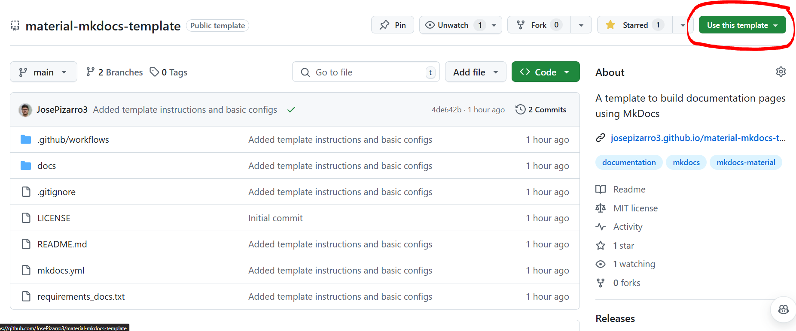
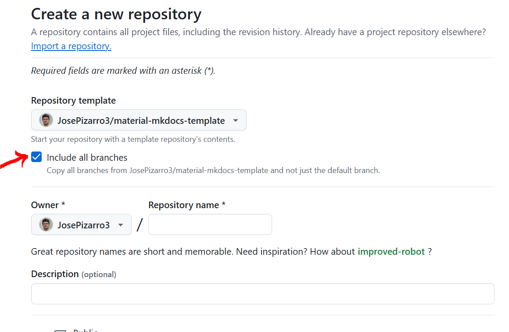

# MkDocs template

A template to build documentation pages using MkDocs, especifically using the Material for MkDocs theme and the PyMdown extensions.


## Getting started

Clone this repository by clicking on the top right button, `Use this template`:



You can decide which organization or account to host the new repository. Don't forget to check the `Include all branches` button.



## The configuration file

The configuration file should appear in the root of your project with the name `mkdocs.yml`. Here, you can control the structure and customization (with different themes, extensions, assets, etc.) of your page.

I tried adding some of the most useful configurations and comments in the `mkdocs.yml`, but it is a good idea to visit the (amazing) documentation page of [Material for MkDocs](https://squidfunk.github.io/mkdocs-material/getting-started/).

## Adding pages

The pages in MkDocs are written in [Markdown](https://www.markdownguide.org/) and are found in the folder `docs`. The structure is defined in the `mkdocs.yml` under the `nav` key.

## Local development

In order to develop and write the documentation page, you only need an OS with Python 3.x. Then, you have to:

* Create a virtual environment (either with venv or conda). In my case I used Ubuntu 22.04 to setup my environment:
```sh
python3 -m venv .venv
source .venv/bin/activate
```
* Make sure `pip` is upgraded:
```sh
pip install --upgrade pip
```
* Install the dependencies:
```sh
pip install -r requirements_docs.txt
```
* Run the MkDocs page:
```sh
mkdocs serve
```

You will get an output which looks like this:
```sh
INFO    -  Building documentation...
INFO    -  Cleaning site directory
INFO    -  [14:07:47] Watching paths for changes: 'docs', 'mkdocs.yml'
INFO    -  [14:07:47] Serving on http://127.0.0.1:8000/
```

Simply click on the local address (http://127.0.0.1:8000/) to see the page launched.

Everytime you modify and save your files, the MkDocs page will automatically update with the latest changes.

## Github page

Once the MkDocs page is ready, you can push the changes into your main branch. 

The pipeline defined in `.github/workflows/mkdocs-deploy.yml` will deploy the MkDocs page on the Github page of your repository. This is in the branch called `gh-page` (this is the reason why the button `Include all branches` should be checked). Everytime someone pushes changes into the `main` branch, the pipeline will update the MkDocs page.

The Github/MkDocs page have the format: https://<ORGANIZATION/USER-NAME>.github.io/<REPOSITORY-NAME>/